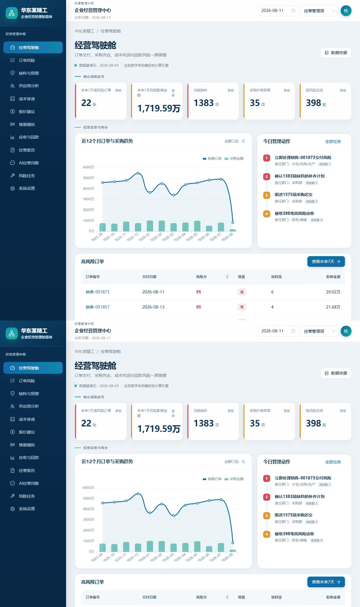
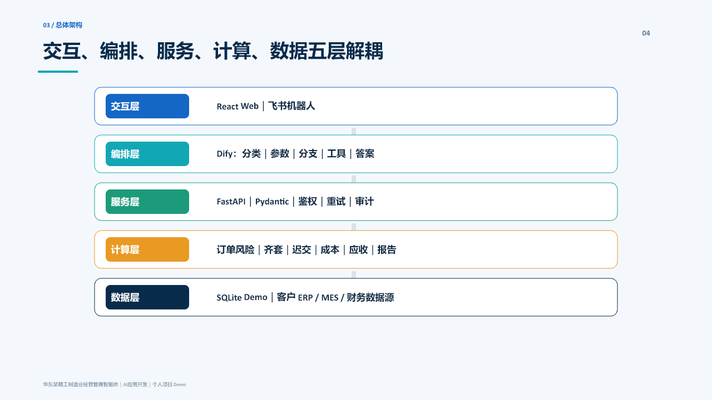
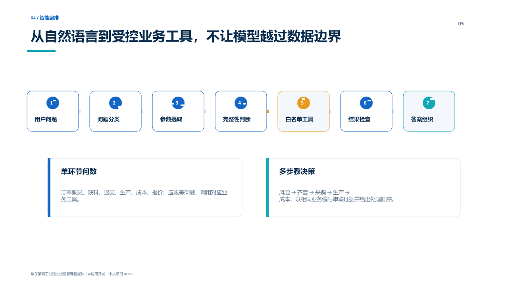
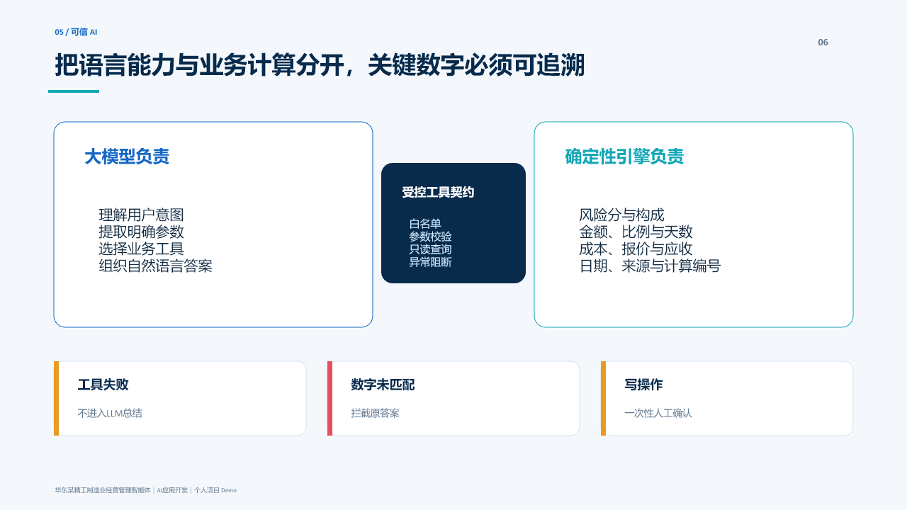
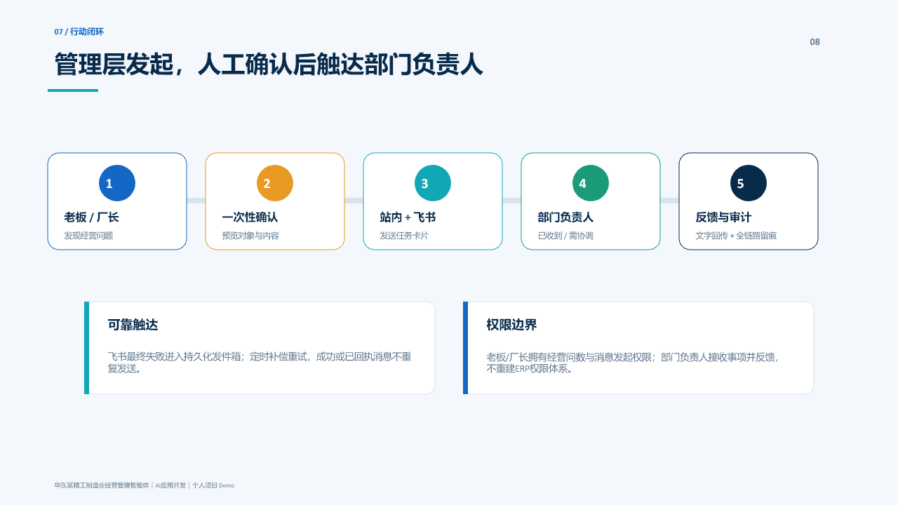
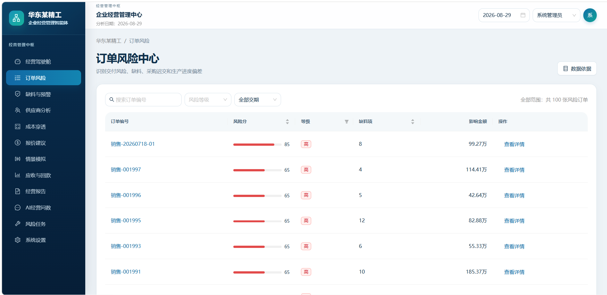
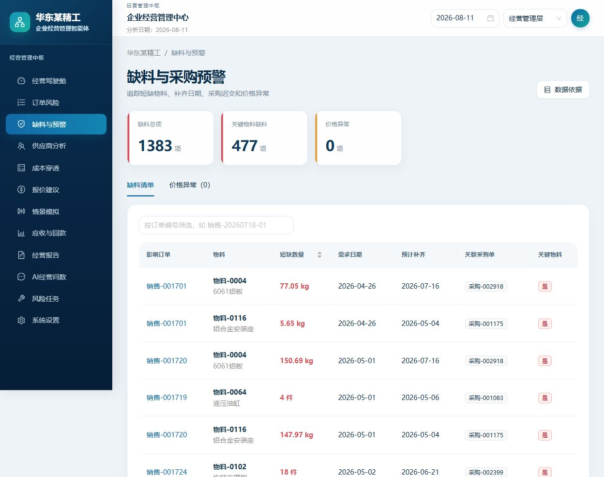
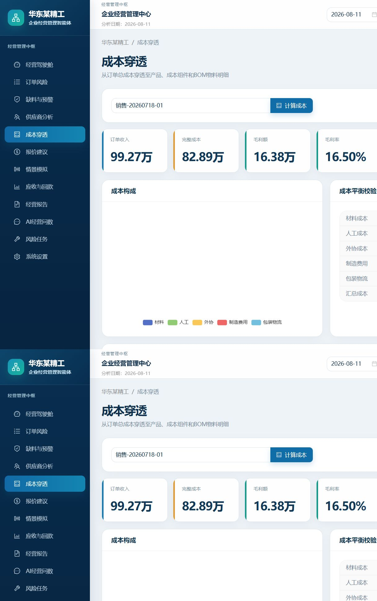
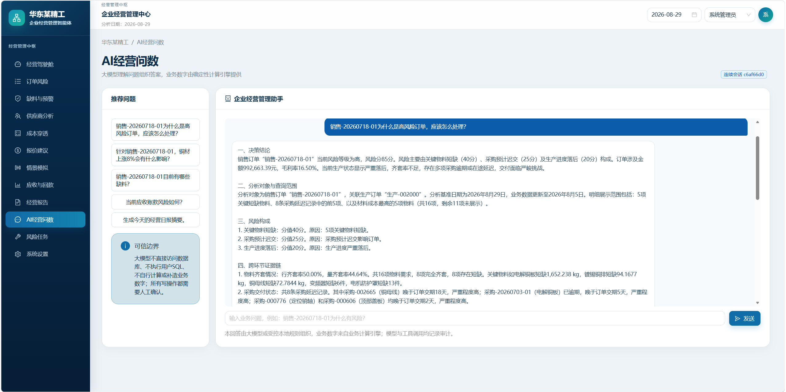

# 离散制造业企业经营管理智能体

[](https://github.com/shu253/manufacturing-operations-copilot/actions/workflows/ci.yml)

面向离散制造企业的经营分析与决策执行智能体。项目建立在企业现有 ERP、MES、采购、库存和财务数据之上，通过确定性业务计算、Dify 工作流、Web 经营驾驶舱与飞书行动闭环，帮助老板或厂长发现经营风险、追溯原因并推动责任部门落实。

> 本仓库为个人项目展示与技术原型。企业、客户、供应商、员工、订单和经营数字均为虚构或脱敏演示数据，不代表真实企业，也不表示已在客户生产环境上线。

[English](README_EN.md) · [面向 AI 解决方案工程师](docs/08-for-solution-engineer.md) · [面向 AI 应用开发](docs/09-for-ai-developer.md)



## 项目解决的问题

制造企业的订单、采购、库存、生产、成本和回款数据通常分散在多个系统。管理层能够看到报表，却很难及时回答：

- 哪些订单可能无法按期交付，风险由什么构成？
- 缺料、采购迟交和生产落后是否影响同一张订单？
- 当前订单真实完整成本和毛利是多少？
- 应该先处理哪件事，由哪个部门负责？
- 大模型回答中的金额、比例和天数能否追溯到业务数据？

本项目将确定性业务引擎与大模型分工：业务数字由代码计算，大模型负责理解问题、编排工具和组织表达。

## 核心能力

- **12 个 Web 模块**：驾驶舱、订单风险、缺料预警、供应商、成本、报价、情景模拟、应收、报告、AI 问数、风险任务和系统设置。
- **15 个受控业务工具**：订单、物料、采购、生产、供应商、成本、报价、应收、报告和制度检索。
- **多步骤决策分析**：按业务编号串联订单风险、齐套、采购迟交、生产进度和成本证据。
- **可信数字控制**：禁止模型访问数据库和执行 SQL；关键数字必须能够在工具结果中核验。
- **飞书行动闭环**：老板/厂长发起，人工确认后发送，部门负责人回执与反馈。
- **工程可靠性**：网络重试、失败发件箱、补偿重试、Token/费用审计和操作审计。
- **经营报告**：日报、周一至基准日的周报、月初至基准日的月报，并支持五种导出格式。

## 总体架构



```text
ERP / MES / 采购 / 库存 / 财务数据
                    ↓
         确定性经营计算引擎
                    ↓
          FastAPI 受控工具层
                    ↓
       Dify 意图识别与工作流编排
                    ↓
     React Web / 飞书机器人 / 行动闭环
```

技术栈：Python、FastAPI、Pydantic、SQLite、React、TypeScript、Ant Design、ECharts、Dify、通义千问、飞书开放平台。

## 关键实现

### 1. 确定性经营计算

`business_engine/` 负责物料齐套、采购迟交、生产进度、订单风险、供应商评分、完整成本、报价、七类情景模拟、应收风险和经营报告。统一返回计算编号、公式版本、基准日期、证据和告警。

### 2. 受控 AI 工具网关

`api/ai_tools.py` 将计算能力暴露为白名单工具。工具只接受订单、物料、供应商、日期、数量和比例等业务参数，不接受 SQL、数据库路径、表名或任意接口地址。

### 3. Dify 多步骤工作流

`dify/` 保存 OpenAPI 工具定义、工作流说明、提示词和数字校验代码。复杂问题通过同一业务编号建立跨环节证据链，工具异常时进入安全分支，不直接进入大模型总结。



### 4. 可信 AI 控制

```text
用户问题 → 意图与参数 → 白名单工具 → 确定性计算
        → 来源和计算编号 → 大模型表达 → 数字核验 → 返回
```



### 5. 飞书行动闭环

涉及发送消息的操作先生成预览和一次性确认令牌；确认后创建站内消息并发送飞书卡片。部门负责人可选择“已收到”“需要协调”或提交文字反馈，失败发送进入持久化发件箱。



## 功能截图

| 订单风险 | 缺料与预警 |
|---|---|
|  |  |

| 成本穿透 | AI经营问数 |
|---|---|
|  |  |

更多截图位于 [`assets/screenshots`](assets/screenshots)。

## 快速开始

### 环境要求

- Python 3.9+
- Node.js 20+
- pnpm 9+
- Windows PowerShell（使用一键脚本时）

### 1. 安装依赖

```powershell
python -m venv .venv
.\.venv\Scripts\Activate.ps1
pip install -r requirements.txt

cd web
pnpm install --frozen-lockfile
cd ..
```

### 2. 生成可复现演示数据

```powershell
python .\scripts\generate_demo_data.py
python .\scripts\validate_demo_data.py
```

数据库和 CSV 在本地生成，并已被 `.gitignore` 排除。固定随机种子便于测试和复现。

### 3. 启动系统

```powershell
.\scripts\start_demo.ps1
```

- Web：<http://127.0.0.1:5173>
- FastAPI 文档：<http://127.0.0.1:8000/docs>

停止：

```powershell
.\scripts\stop_demo.ps1
```

未配置 Dify 时，AI 问数使用本地受控编排；配置 Dify 和飞书前，请复制 `.env.example` 为 `.env` 并只在服务端填写密钥。

## 测试

```powershell
python .\scripts\generate_demo_data.py
python -m unittest discover -s tests -v

cd web
pnpm run test
pnpm run build
```

GitHub Actions 会在每次 Push 和 Pull Request 时重新生成演示数据、运行后端测试、前端单元测试和构建检查。

## 文档导航

- [产品概览](docs/01-product-overview.md)
- [离散制造业务流程](docs/02-business-process.md)
- [系统架构](docs/03-system-architecture.md)
- [Dify 工作流](docs/04-dify-workflow.md)
- [可信 AI 设计](docs/05-trusted-ai-design.md)
- [飞书行动闭环](docs/06-feishu-action-loop.md)
- [部署与产品化边界](docs/07-deployment-guide.md)
- [AI 解决方案工程师视角](docs/08-for-solution-engineer.md)
- [AI 应用开发视角](docs/09-for-ai-developer.md)

## 项目边界

当前版本使用 SQLite 和模拟数据，Web 角色切换用于产品演示，Dify/飞书密钥由使用者自行配置。正式落地需要根据客户 ERP/MES 数据结构开发适配器，并补充企业 SSO、多租户隔离、集中密钥管理、云端常驻部署、监控告警、备份恢复和安全评估。

## Copyright

仓库未附带开源许可证。使用边界见 [NOTICE.md](NOTICE.md)，安全说明见 [SECURITY.md](SECURITY.md)。

